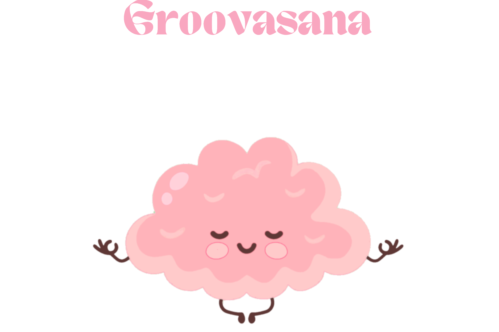

# Groovasana

## **Getting Started** ##
[Link to deployed application](https://groovasana-2b1896f660ee.herokuapp.com/)

[Planning Materials](https://trello.com/b/sRjEU0UR/unit-4-project)

## **Description** ##
Groovasana is a task maangement web application that was designed thinking of neurodiverse minds. It helps users organize their day with clarity and flow by breaking todos into smaller sub-tasks, assigning pre-defined categories, and using a clean, pastel aesthetic for stress-free planning.

## **Background** ##
This project was built as part of my bootcamp with General Assembly. I wanted to create a tool that not only organizes todos, but also reduces overwhelm with a soft, yoga-inspired UI and features tailored to ADHD-friendly workflows.

## Attributions ##
**Fonts:** [Yeseva One](https://fonts.google.com/specimen/Yeseva+One) & [Karla](https://fonts.google.com/specimen/Karla) (from Google Fonts).

**Icons and images:**

- Logo:
    - Image inspired by [KnowledgeOne](https://knowledgeone.ca/how-to-help-your-brain-unplug/)
    - Redesigned using Procreate (color changes)

- [Flaticon](https://www.flaticon.com/)
    - *packs used: [Valentines Day]("https://www.flaticon.com/free-icons/love-and-romance"),
    [Family](https://www.flaticon.com/free-icon/family_2880566), [Organization](https://www.flaticon.com/free-icon/high-five_3300308), [Medical](https://www.flaticon.com/free-icon/heart_5641359), [Home Living](https://www.flaticon.com/free-icon/home_2478295), [Travel](https://www.flaticon.com/free-icon/travel_6159218), [Creative Process](https://www.flaticon.com/free-icon/idea_2099499), [Startup](https://www.flaticon.com/free-icon/briefcase_2169727), [Recipes](https://www.flaticon.com/free-icon/frying-pan_12055282),  [Beauty](https://www.flaticon.com/free-icon/candle_1941263),[Saint Jordi](https://www.flaticon.com/free-icon/books_15564257), [Morning Routine](https://www.flaticon.com/free-icon/to-do-list_6683919)*.

- FontAwesome:
    - [Trash Icon](https://fontawesome.com/icons/trash?s=solid)
    - [Pencil Icon](https://fontawesome.com/icons/pencil?f=classic&s=solid)

Vecteezy: [Clipboard](https://www.google.com/url?sa=i&url=https%3A%2F%2Fwww.vecteezy.com%2Fvector-art%2F6795707-cute-funny-clip-board-character-vector-hand-drawn-cartoon-kawaii-character-illustration-icon-isolated-on-white-background-clip-board-character-concept&psig=AOvVaw3pRdf04hMa0D1b9lJ_tqqk&ust=1753748507806000&source=images&cd=vfe&opi=89978449&ved=0CBYQjRxqFwoTCPjyi7mk3o4DFQAAAAAdAAAAABAW)

## Technologies Used ##
**Backend:** Python, Django

**Frontend:** HTML, CSS, JavaScript

**Other Tools:** GIT, VS Code, [Black](https://github.com/psf/black)

## Next Steps ##
Groovasana will always have room to grow! Here are some planned enhancements:

- Monthly Summary: A motivational end-of-month recap, inspired by Spotify's Spotify Wrapped, highlighting completed tasks and milestones as a reward system for users
- Inline Subtask Editing: Rather than having a separate page for editing subtasks, replace it with a JavaScript event listener, allowing users to update subtasks directly on the todo detail page for a smoother workflow.
- Repeatable To Dos: Introduce recurring tasks for building daily routines or habit tracking
- Integrated Timer: Add a built in timer on the todo details page, synced with each todo's estimated time field to support time management, accountability, and reduce time blindness.
UI/UX Enhancements: Refine CSS to better align with the original wireframes (see Trello board) and improve overall visual consistency.
